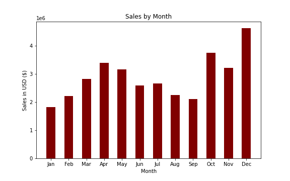

# Electronic Store Sales Analysis

## Project Overview
- Analysing the data from an electronic store, which contains 12 months worth of sales data.
- Getting insights from the data to understand some correlations in order to increase the store profits.
- Exploring the sales by their product types, costs, purchase city, time of the year and time of purchase.
- The main Python libraries used in this project analysis were Pandas, Numpy, Matplotlib and Seaborn. Access the Jupyter Notebook **[here](https://github.com/ThiPauli/Sales_Analysis_Project/blob/main/Sales%20Analysis/Electronics%20Sales%20Analysis.ipynb)**.
- Sales Dashboard was built in Python and the Streamlit and Plotly libraries. Access the Python code **[here](https://github.com/ThiPauli/Sales_Analysis_Project/blob/main/app.py)**.
- The Dashboard was deployed using Heroku. Acess the Sales Dashboard via https://saleseletronicsdashboard.herokuapp.com/

## Objectives
### The goal is to answer business questions as follow:
* Which months generated the highest profits?
* Which cities purchased the most?
* Which products sold the most?

### Additionally, other questions which may help to understand relationships in order to decision-making process in the future to increase the sales.
* Which day time customers bought the most? Order x Time.
* Which products are bought together? Orders which have more than 1 purchase.

## Exploratory Data Analysis and Data Cleaning
### Data Cleaning
* Checking columns with missing values.
* Drop NaN values from DataFrame.
* Convert column as object to datetime.

### Exploratory Data Analysis
* Adding new columns as well as extracting months and hours from the order date.
* Using groupby to perform aggregate analysis.
* Using .apply() method to get the city names for each sale.
* Using .transform() method to get all product names of the same order.
* Plotting bar charts and lines graphs to visualize the results.

## Data analysis

