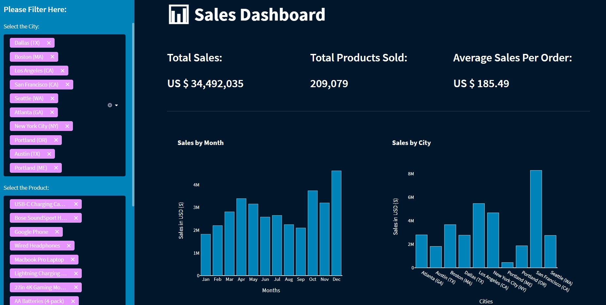

# Electronic Store Sales Analysis

## Project Overview
- Analysing the data from an electronic store, which contains 12 months worth of sales data.
- Getting insights from the data to understand some correlations in order to increase the store profits.
- Exploring the sales by their product types, costs, purchase city, time of the year and time of purchase.
- The main Python libraries used in this project analysis were Pandas, Numpy, Matplotlib and Seaborn. Access the Jupyter Notebook **[here](https://github.com/ThiPauli/Sales_Analysis_Project/blob/main/Sales%20Analysis/Electronics%20Sales%20Analysis.ipynb)**.
- Sales Dashboard was built in Python and the Streamlit and Plotly libraries. Access the Python code **[here](https://github.com/ThiPauli/Sales_Analysis_Project/blob/main/app.py)**.
- The Dashboard was deployed using Heroku. Acess the Sales Dashboard via https://saleseletronicsdashboard.herokuapp.com/

## Objectives
### The goal is to answer business questions as follow:
* Which months generated the highest profits?
* Which cities purchased the most?
* Which products sold the most?

### Additionally, other questions which may help to understand relationships in order to decision-making process in the future to increase the sales.
* Which hour of the day customers bought the most? Order x Time.
* Which products are bought together? Orders which had more than 1 purchase.

## Exploratory Data Analysis and Data Cleaning
### Data Cleaning
* Checking columns with missing values.
* Drop NaN values from DataFrame.
* Convert column as object to datetime.

### Exploratory Data Analysis
* Adding new columns as well as extracting months and hours from the order date.
* Using groupby to perform aggregate analysis.
* Using .apply() method to get the city names for each sale.
* Using .transform() method to get all product names of the same order.
* Plotting bar charts and lines graphs to visualize the results.

## Data analysis and visualizations
* Defining the total sales per each month in order to know what month had the highest profit and its values.

* Defining the total sales and getting the results per city.

* Evaluating the purchase's time of all cities (top) as well as for each city (bottom)(Seattle (WA) in this case). Evaluated by the hour purchased in each sale.

* Evaluating the most sold products. Data grouped by their products and the total number of sales. Also, the price of each product was considered to evaluate their relationship.

* Evaluating the orders which have more than 1 purchase by the same customer to see which products are most sold together. Evaluated the total number of sales of the pair of products bought together.

## Sales Dashboard
- The dashboard show up some KPIs at the top (Total Sales, Total Products Sold and Average Sales per Order).
- It is possible to filter by cities and products and check it out how the charts behaves.

## Conclusions
* December was the best month with more than 4.5 million dollars in sales followed by October and November, which also generated great results. Results might reflect the demand of this specific time of the year.
* There is more demands for this type of product in San Francisco.
* The peaks of purchasing time (hour) for some cities are slightly different from the general analysis (all cities). Therefore, if the goal is to display advertisements in a certain time to maximize the likelihood of customer’s buying product, it is possible to plan the advertisement better for the specific city. For example, Seattle (WA) has a peak at 18 (6 PM), so it could be better to display advertisements for that public a little bit earlier from 18 (6 PM).
* The most sold products are basically accesories, such as bateries, USB cable and so on, which are products that need to be replaced more frequently than other products. Additionally, the costs of them might get an influence as well. There is some correlationship for the most sold products have the lowest prices too. However, for instance, Macbook is more expensive than LG washing machine but there is more demand for this kind of product.
* The 2 most products bought together in one order was iPhone and Lightning Charging Cable. Therefore, it adivisable, when the customer buys one of them, to recommend the other one. Last but not least, the marketing could plan package options for those items to increase the sales even more.
